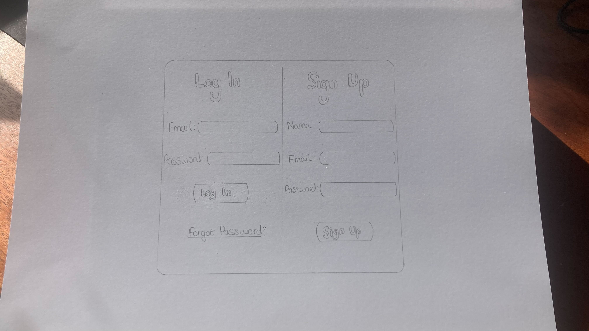
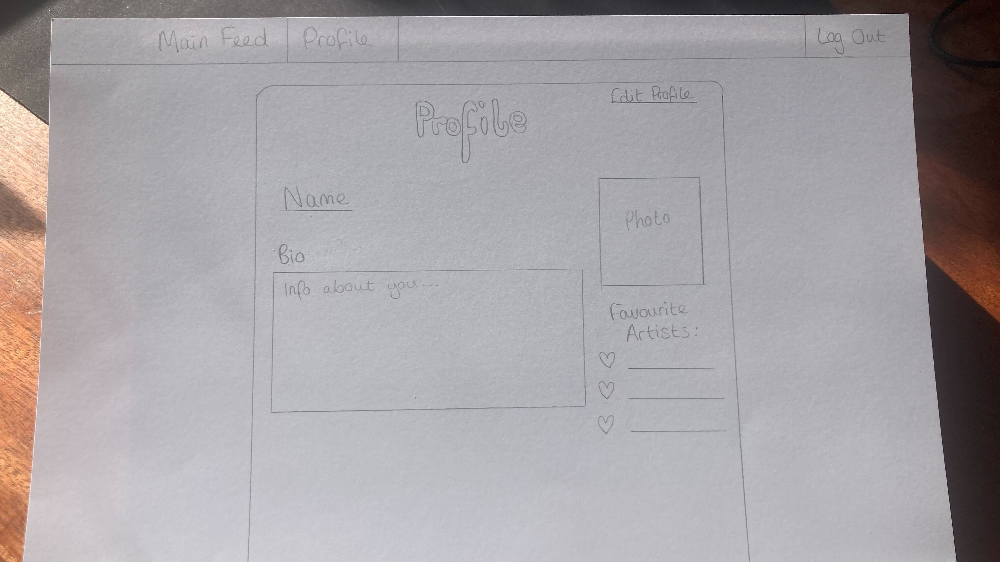
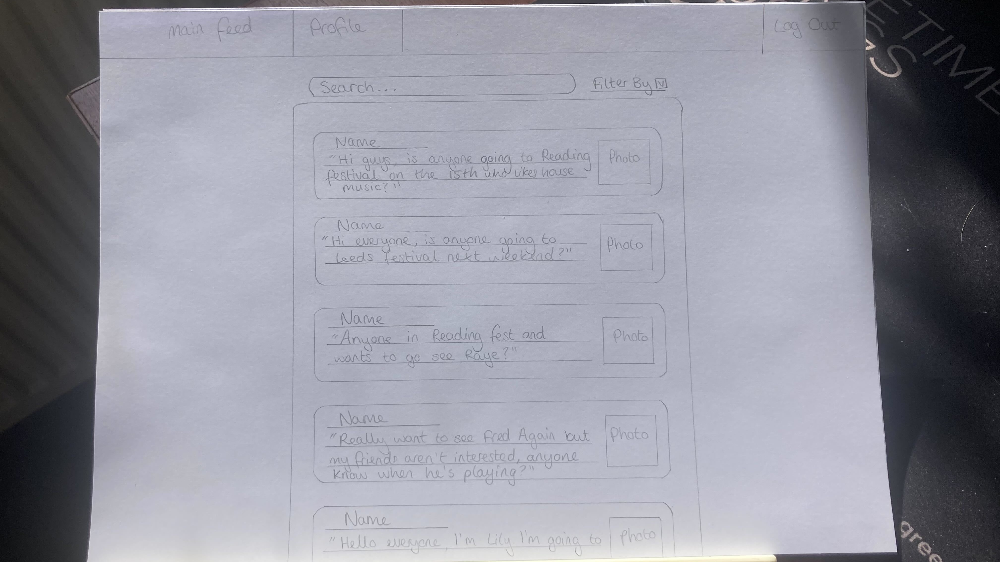
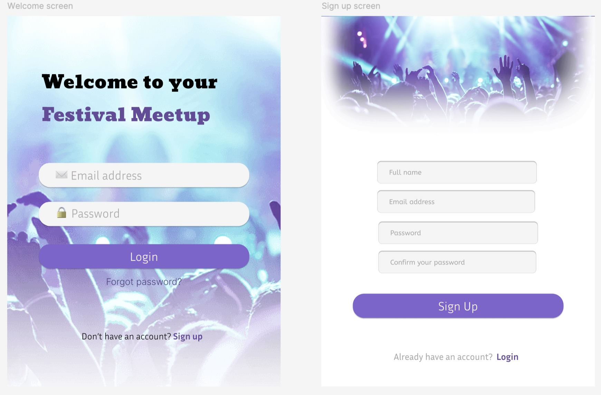
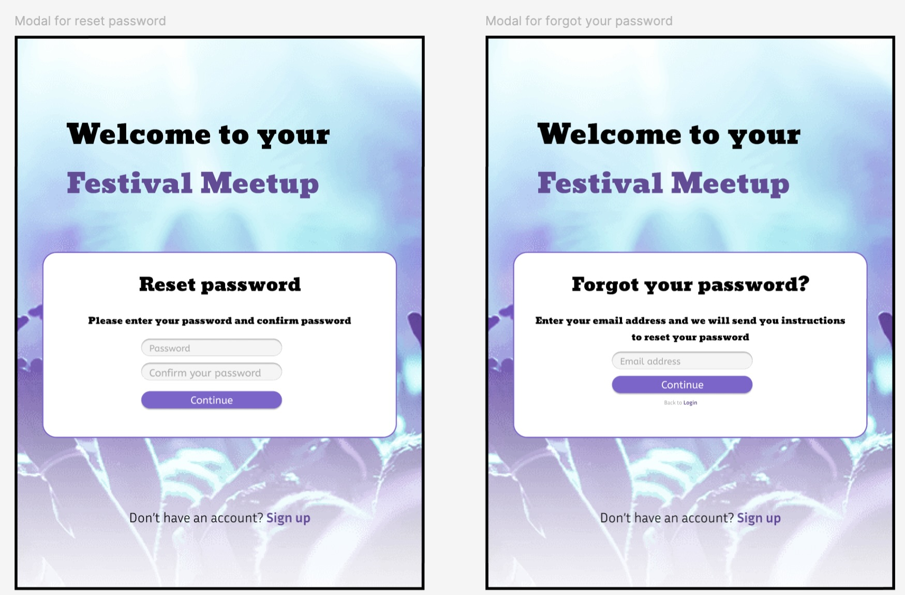
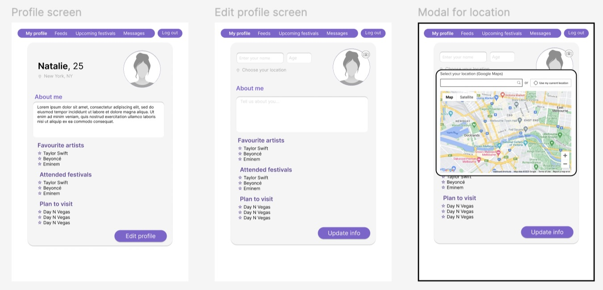
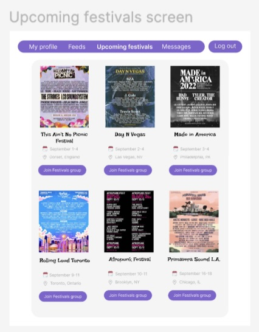
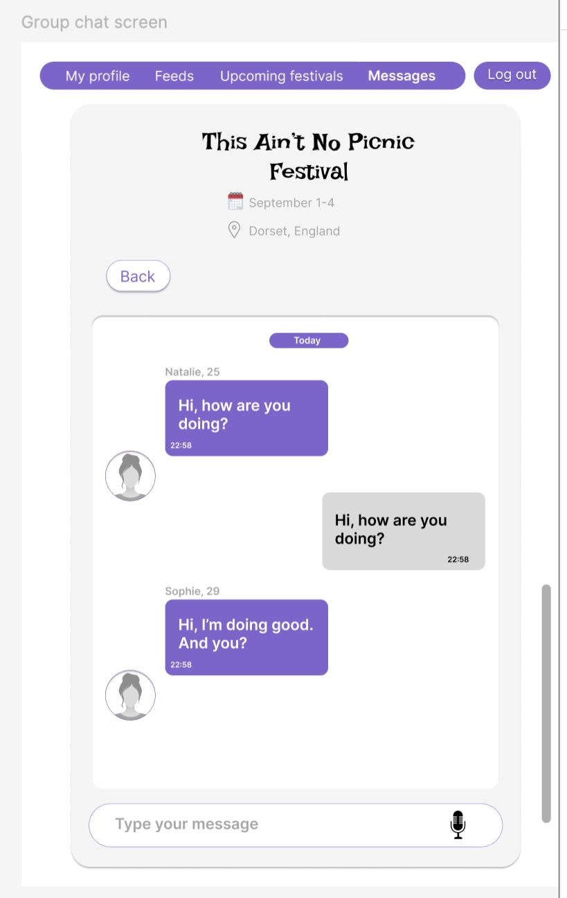
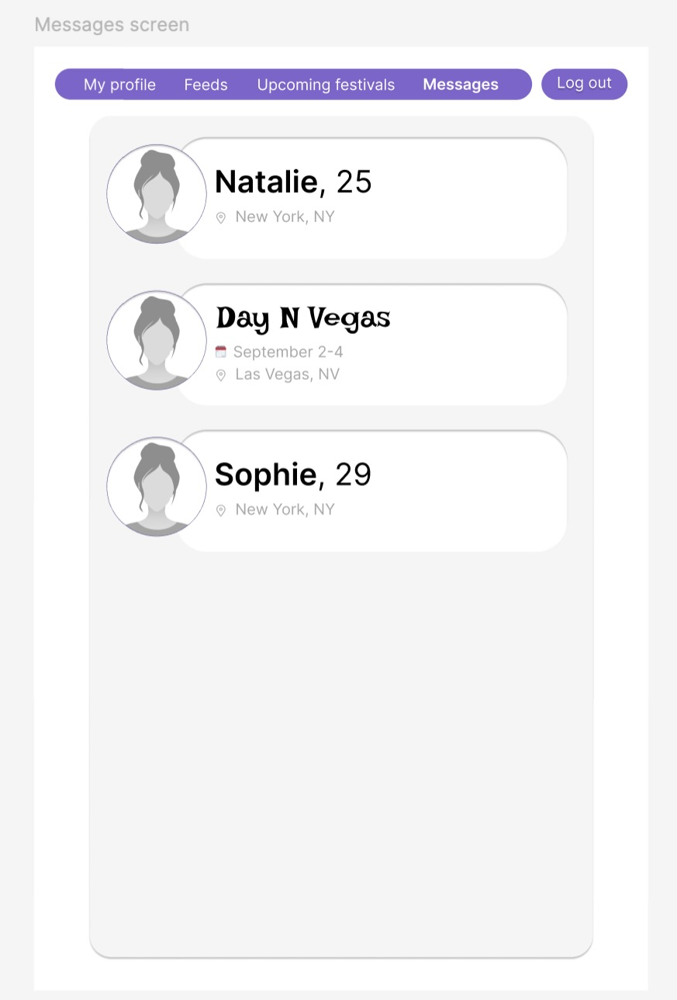

# CFG-degree-fullstack-group-project-2024

This repository contains the group project work for the CFG Fullstack Degree of summer 2024: "Festival Meetup" app.

> # Festival Meetup App

This **README.md** file contains all the details for the building of our 'Festival Meetup App'.

## _Intructions for execution of the code_

1. Set up the development environment:

- Install Node.js and npm.

- Clone the repository from GitHub.

2. Install the project dependencies:

- `cd` into repository.

- Run `npm install` in the root, frontend and backend folders.

3. Run the React application:

- Start the development server in the frontend with `npm start`.

- Start the backend server with `node index.js`.

- Build the production environment with `npm run build`.

4. Set up the database in MySQL using the `index.sql` file.

5. Change the environment variables using the `.env.example` file and change the database password to your own.

6. The app should now be working. You can test by running the backend and frontend servers.

## _Part 1: project details_

### What is the concept?

The aim of the “festival Meetup” app is to connect festival goers together. The app would allow users to sign up and create an account, then post a ‘meetup’ for a particular festival and connect with other users who would be able to request to join the meetup. The aim of this app is to help festival goers connect with each other while attending the same festivals whether they are alone or not.

---

### Who is our target audience?

- The target audience is festival goers. As festivals are attended by men and women of all ages, it is not aimed as a specific age or gender bracket, however when users set up a ‘meet’, the app could allow users to state their own and their desired ‘meetup’ demographic.

- The “Festival Meetup” app is aimed mainly at solo festival goers, who would like to meet up with other individuals attending the same festival. The app would allow users to connect prior to the festival and to pre-arrange meeting up with each other. This would benefit solo festival goers as the app would allow them to make plans with like minded people, and give them the opportunity to set up a camp together (providing an element of safety), attend various acts together and to meet new people with similar music interests.

---

### What are the main features of our project?

_1. User authentication_

- Secure user authentication

_2. Profile management_

- Sign-up/Login: users can create an account and log in.

- Profile Creation: users can create and edit their profiles, adding information like interests and bio.

_3. Festival List_

- Display a list of upcoming festivals fetched from an external API (e.g., Ticketmaster or Eventbrite).

_4. Group interactions_

- Group creation: Users can create a meet up group for specific festivals, specifying details like group name and description, their attendance and artists they want to see.

- Join groups: users can browse and join existing groups.

_5. API Integration_

- Custom API

- External API: fetch festival data from an external API (e.g., Ticketmaster) and display it in the app.

---

### What workflow methodology will we use?

We will use the Agile methodology to have a flexible workflow system to accomodate different schedules.

---

### What tools will we use to build this project?

- Design

  - Figma

- Front end

  - HTML, CSS, Javascript
  - React

- Back end

  - SQL
  - Custom API
  - Third party API (Ticketmaster or Eventbrite)

---

### How will we organise the workload?

- Using our SWOT analysis, tasks will be divided according to our individual strengths whilst also giving members the opportunity to improve their skills in areas for development.

- The timeframe to complete the main part of the project is three weeks which will allow one week for resolving issues.

- Coding in pairs will be beneficial to help make progress on more complex tasks within the time frame given to complete the project.

- We will also need to take into account individual's schedules to distribute tasks as some members are currently working full-time or shift work.

---

## _Part 2: design_

### Hand-drawings

**_Welcome/login drawing_**

**_Profile drawing_**

**_Feed drawing_**

---

### Wireframes

**_Welcome/login_**

The following wireframes are the final design we came up.

The first screen is a welcome screen where users can either login if they already have an account or press the sign up option if they don't which will take them to another screen.

---

**_Reset/ forgot password screen_**

In case users have forgotten their password, they can click the option on the welcome screen which will come up with eiher a modal to reset it by entering email and new password.

---

**_Profile screen_**

Once users have signed in, it will take them to their profile page that contains a navigation bar at the top from where they can access the other features of the site: main feed with other users, upcoming festivals and messages.

Users have the option to edit their profile and choose their location where a modal pops up.

---

**_Festivals feed/ messages screen_**

The festivals screen shows all the different festivals that are coming up with some basic info about each one. This will be accessed through an third-party API.

By clicking the "Join Festivals group" option, users can join a chat and interact with other users attending it as shown on the second screen.

This chat will appear in the messages screen for each user which they can also access via the "Messages" opiton in the navigation bar.

 

